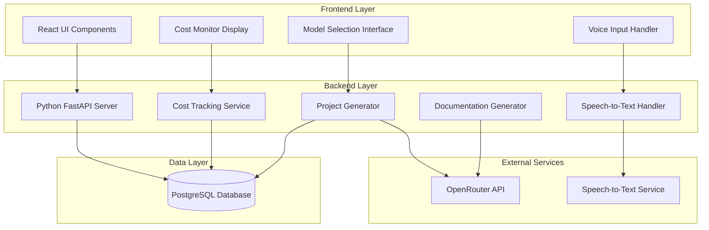

# Design Document: AutoBuilder-AI

## Overview

AutoBuilder-AI is a full-stack web application that enables users to generate complete project structures from natural language descriptions. The system architecture follows a three-tier design with a React frontend, Python backend, and PostgreSQL database. The core innovation is the integration with OpenRouter API to provide users with manual control over AI model selection for different tasks, combined with comprehensive cost tracking and code explainability features.

The system processes user input (text or voice), coordinates with selected AI models to generate project plans and code, creates structured file outputs with documentation, and tracks all API usage and costs. The architecture emphasizes modularity, allowing independent scaling of the frontend, backend, and database layers.

## Architecture

### High-Level Architecture



### Component Interaction Flow

1. **Input Phase**: User provides project description via text input or voice recording
2. **Model Selection Phase**: User selects AI models for planning and code generation tasks
3. **Generation Phase**: Backend coordinates with OpenRouter API to generate project structure and files
4. **Documentation Phase**: System generates README, setup guides, and API documentation
5. **Persistence Phase**: Complete project saved to PostgreSQL with metadata
6. **Cost Tracking Phase**: Token usage and costs calculated and stored

### Technology Stack Rationale

- **React Frontend**: Component-based architecture for reusable UI elements, strong ecosystem for state management
- **Python Backend**: Excellent AI/ML library support, FastAPI for high-performance async API handling
- **PostgreSQL**: Robust relational database for structured project data, JSON support for flexible file storage
- **OpenRouter API**: Single integration point for multiple AI models, cost-effective model selection

## Components and Interfaces

### Frontend Components

#### 1. ProjectInputComponent
**Responsibility**: Capture and validate user project descriptions

**Interface**:
```typescript
interface ProjectInputProps {
  onSubmit: (description: string) => void;
  onVoiceToggle: (isActive: boolean) => void;
}

interface ProjectInputState {
  description: string;
  isVoiceActive: boolean;
  validationError: string | null;
}
```

**Key Methods**:
- `handleTextChange(text: string)`: Update description from text input
- `handleVoiceTranscription(text: string)`: Update description from voice input
- `validateDescription(): boolean`: Ensure description is non-empty and within limits
- `submitDescription()`: Validate and emit description to parent

#### 2. ModelSelectorComponent
**Responsibility**: Display available AI models and capture user selection

**Interface**:
```typescript
interface ModelSelectorProps {
  taskType: 'planning' | 'coding' | 'debugging';
  availableModels: AIModel[];
  onModelSelect: (modelId: string) => void;
}

interface AIModel {
  id: string;
  name: string;
  costPer1kTokens: number;
  avgResponseTime: number;
  capabilities: string[];
}
```

**Key Methods**:
- `fetchAvailableModels()`: Retrieve model list from backend
- `displayModelComparison()`: Show side-by-side model characteristics
- `selectModel(modelId: string)`: Emit selected model to parent

#### 3. CostMonitorComponent
**Responsibility**: Display real-time and historical cost/token usage

**Interface**:
```typescript
interface CostMonitorProps {
  sessionId: string;
}

interface CostData {
  sessionTokens: number;
  sessionCost: number;
  totalTokens: number;
  totalCost: number;
  costByTaskType: Record<string, number>;
}
```

**Key Methods**:
- `fetchCurrentSessionCost()`: Get current session usage
- `fetchHistoricalCost()`: Get all-time usage statistics
- `displayCostBreakdown()`: Show costs by task type
- `checkThresholdWarning()`: Display warning if threshold exceeded

#### 4. ProjectGenerationComponent
**Responsibility**: Orchestrate generation workflow and display progress

**Interface**:
```typescript
interface ProjectGenerationProps {
  description: string;
  selectedModels: Record<string, string>;
  explainabilityMode: boolean;
}

interface GenerationProgress {
  currentPhase: 'planning' | 'coding' | 'documentation';
  currentFile: string | null;
  completedFiles: string[];
  estimatedTimeRemaining: number;
}
```

**Key Methods**:
- `startGeneration()`: Initiate project generation workflow
- `updateProgress(progress: GenerationProgress)`: Update UI with current status
- `handleGenerationComplete(projectId: string)`: Display summary and download options
- `handleGenerationError(error: Error)`: Display error and retry options

#### 5. ProjectListComponent
**Responsibility**: Display saved projects and enable retrieval

**Interface**:
```typescript
interface ProjectListProps {
  userId: string;
}

interface SavedProject {
  id: string;
  name: string;
  description: string;
  createdAt: Date;
  fileCount: number;
  totalCost: number;
}
```

**Key Methods**:
- `fetchProjects()`: Retrieve user's saved projects
- `filterProjects(criteria: FilterCriteria)`: Apply filters to project list
- `sortProjects(field: string, order: 'asc' | 'desc')`: Sort project list
- `downloadProject(projectId: string)`: Trigger ZIP download
- `deleteProject(projectId: string)`: Remove project from database

### Backend Components

#### 1. ProjectGeneratorService
**Responsibility**: Coordinate AI model interactions to generate project structure and code

**Interface**:
```python
class ProjectGeneratorService:
    def __init__(self, openrouter_client: OpenRouterClient, db: Database):
        self.openrouter_client = openrouter_client
        self.db = db
    
    def generate_project(
        self,
        description: str,
        planning_model: str,
        coding_model: str,
        explainability_mode: bool
    ) -> ProjectGenerationResult:
        """Generate complete project from description"""
        pass
    
    def generate_project_plan(
        self,
        description: str,
        model: str
    ) -> ProjectPlan:
        """Generate high-level project structure and tech stack"""
        pass
    
    def generate_code_files(
        self,
        plan: ProjectPlan,
        model: str,
        explainability_mode: bool
    ) -> List[CodeFile]:
        """Generate individual code files based on plan"""
        pass
    
    def save_project(
        self,
        project: GeneratedProject,
        metadata: ProjectMetadata
    ) -> str:
        """Save project to database and return project ID"""
        pass
```

**Key Data Structures**:
```python
@dataclass
class ProjectPlan:
    directory_structure: Dict[str, Any]
    tech_stack: List[str]
    file_list: List[str]
    dependencies: Dict[str, List[str]]

@dataclass
class CodeFile:
    path: str
    content: str
    language: str
    explanation: Optional[str]

@dataclass
class ProjectGenerationResult:
    project_id: str
    files: List[CodeFile]
    documentation: List[CodeFile]
    total_tokens: int
    total_cost: float
```

#### 2. DocumentationGeneratorService
**Responsibility**: Generate README, setup guides, and API documentation

**Interface**:
```python
class DocumentationGeneratorService:
    def __init__(self, openrouter_client: OpenRouterClient):
        self.openrouter_client = openrouter_client
    
    def generate_readme(
        self,
        project_plan: ProjectPlan,
        code_files: List[CodeFile],
        model: str
    ) -> str:
        """Generate README.md with project overview and features"""
        pass
    
    def generate_setup_guide(
        self,
        project_plan: ProjectPlan,
        model: str
    ) -> str:
        """Generate SETUP.md with installation instructions"""
        pass
    
    def generate_api_documentation(
        self,
        code_files: List[CodeFile],
        model: str
    ) -> Optional[str]:
        """Generate API.md if API endpoints detected"""
        pass
    
    def extract_api_endpoints(
        self,
        code_files: List[CodeFile]
    ) -> List[APIEndpoint]:
        """Parse code files to identify API endpoints"""
        pass
```

#### 3. CostTrackingService
**Responsibility**: Calculate and store token usage and costs

**Interface**:
```python
class CostTrackingService:
    def __init__(self, db: Database):
        self.db = db
        self.model_pricing = {}  # Loaded from OpenRouter
    
    def track_api_call(
        self,
        session_id: str,
        model: str,
        task_type: str,
        input_tokens: int,
        output_tokens: int
    ) -> CostRecord:
        """Record API call and calculate cost"""
        pass
    
    def get_session_cost(self, session_id: str) -> CostSummary:
        """Get cumulative cost for current session"""
        pass
    
    def get_user_total_cost(self, user_id: str) -> CostSummary:
        """Get all-time cost for user"""
        pass
    
    def get_cost_breakdown(
        self,
        user_id: str,
        group_by: str = 'task_type'
    ) -> Dict[str, float]:
        """Get cost breakdown by task type or model"""
        pass
    
    def check_threshold(
        self,
        session_id: str,
        threshold: float
    ) -> bool:
        """Check if session cost exceeds threshold"""
        pass
```

#### 4. SpeechToTextHandler
**Responsibility**: Convert voice recordings to text

**Interface**:
```python
class SpeechToTextHandler:
    def __init__(self, stt_service_client: STTClient):
        self.stt_client = stt_service_client
    
    def transcribe_audio(
        self,
        audio_data: bytes,
        audio_format: str
    ) -> TranscriptionResult:
        """Send audio to STT service and return transcription"""
        pass
    
    def validate_audio(
        self,
        audio_data: bytes,
        audio_format: str
    ) -> bool:
        """Validate audio format and size"""
        pass
```

#### 5. OpenRouterClient
**Responsibility**: Interface with OpenRouter API for AI model access

**Interface**:
```python
class OpenRouterClient:
    def __init__(self, api_key: str):
        self.api_key = api_key
        self.base_url = "https://openrouter.ai/api/v1"
    
    def list_models(self) -> List[ModelInfo]:
        """Fetch available models and their characteristics"""
        pass
    
    def generate_completion(
        self,
        model: str,
        prompt: str,
        max_tokens: int = 4000
    ) -> CompletionResult:
        """Generate completion using specified model"""
        pass
    
    def count_tokens(self, text: str, model: str) -> int:
        """Estimate token count for text"""
        pass
    
    def handle_rate_limit(self, retry_after: int) -> None:
        """Implement exponential backoff for rate limits"""
        pass
```

### API Endpoints

#### Project Generation Endpoints

**POST /api/projects/generate**
- Request: `{ description: string, planningModel: string, codingModel: string, explainabilityMode: boolean }`
- Response: `{ projectId: string, status: string, estimatedTime: number }`
- Description: Initiate project generation (async operation)

**GET /api/projects/generate/{projectId}/status**
- Response: `{ status: string, progress: GenerationProgress, error?: string }`
- Description: Poll generation status

**GET /api/projects/{projectId}**
- Response: `{ project: GeneratedProject, files: CodeFile[], metadata: ProjectMetadata }`
- Description: Retrieve completed project

**GET /api/projects/{projectId}/download**
- Response: ZIP file (application/zip)
- Description: Download project as ZIP archive

**DELETE /api/projects/{projectId}**
- Response: `{ success: boolean }`
- Description: Delete saved project

#### Model Selection Endpoints

**GET /api/models**
- Response: `{ models: AIModel[] }`
- Description: List available AI models with characteristics

**GET /api/models/{modelId}**
- Response: `{ model: AIModel, pricing: PricingDetails }`
- Description: Get detailed model information

#### Cost Tracking Endpoints

**GET /api/costs/session/{sessionId}**
- Response: `{ sessionTokens: number, sessionCost: number, calls: CostRecord[] }`
- Description: Get current session cost data

**GET /api/costs/user/{userId}**
- Response: `{ totalTokens: number, totalCost: number, breakdown: Record<string, number> }`
- Description: Get user's all-time cost data

**POST /api/costs/threshold**
- Request: `{ sessionId: string, threshold: number }`
- Response: `{ exceeded: boolean, currentCost: number }`
- Description: Check if cost threshold exceeded

#### Voice Input Endpoints

**POST /api/voice/transcribe**
- Request: Multipart form data with audio file
- Response: `{ transcription: string, confidence: number }`
- Description: Convert voice recording to text

#### Project Management Endpoints

**GET /api/projects/user/{userId}**
- Query params: `?sort=createdAt&order=desc&filter=...`
- Response: `{ projects: SavedProject[], total: number }`
- Description: List user's saved projects

## Data Models

### Database Schema

#### projects table
```sql
CREATE TABLE projects (
    id UUID PRIMARY KEY DEFAULT gen_random_uuid(),
    user_id VARCHAR(255) NOT NULL,
    name VARCHAR(255) NOT NULL,
    description TEXT NOT NULL,
    created_at TIMESTAMP DEFAULT CURRENT_TIMESTAMP,
    updated_at TIMESTAMP DEFAULT CURRENT_TIMESTAMP,
    planning_model VARCHAR(100),
    coding_model VARCHAR(100),
    explainability_mode BOOLEAN DEFAULT FALSE,
    total_tokens INTEGER DEFAULT 0,
    total_cost DECIMAL(10, 4) DEFAULT 0,
    status VARCHAR(50) DEFAULT 'completed',
    
    INDEX idx_user_id (user_id),
    INDEX idx_created_at (created_at)
);
```

#### project_files table
```sql
CREATE TABLE project_files (
    id UUID PRIMARY KEY DEFAULT gen_random_uuid(),
    project_id UUID NOT NULL REFERENCES projects(id) ON DELETE CASCADE,
    file_path VARCHAR(500) NOT NULL,
    content TEXT NOT NULL,
    language VARCHAR(50),
    explanation TEXT,
    created_at TIMESTAMP DEFAULT CURRENT_TIMESTAMP,
    
    INDEX idx_project_id (project_id),
    UNIQUE (project_id, file_path)
);
```

#### cost_records table
```sql
CREATE TABLE cost_records (
    id UUID PRIMARY KEY DEFAULT gen_random_uuid(),
    session_id VARCHAR(255) NOT NULL,
    user_id VARCHAR(255) NOT NULL,
    project_id UUID REFERENCES projects(id) ON DELETE SET NULL,
    model VARCHAR(100) NOT NULL,
    task_type VARCHAR(50) NOT NULL,
    input_tokens INTEGER NOT NULL,
    output_tokens INTEGER NOT NULL,
    cost DECIMAL(10, 6) NOT NULL,
    created_at TIMESTAMP DEFAULT CURRENT_TIMESTAMP,
    
    INDEX idx_session_id (session_id),
    INDEX idx_user_id (user_id),
    INDEX idx_created_at (created_at)
);
```

#### model_cache table
```sql
CREATE TABLE model_cache (
    id VARCHAR(100) PRIMARY KEY,
    name VARCHAR(255) NOT NULL,
    cost_per_1k_input_tokens DECIMAL(10, 6),
    cost_per_1k_output_tokens DECIMAL(10, 6),
    avg_response_time INTEGER,
    capabilities JSONB,
    last_updated TIMESTAMP DEFAULT CURRENT_TIMESTAMP,
    
    INDEX idx_last_updated (last_updated)
);
```

### Domain Models

#### Project Domain Model
```python
from dataclasses import dataclass
from datetime import datetime
from typing import List, Optional
from uuid import UUID

@dataclass
class Project:
    id: UUID
    user_id: str
    name: str
    description: str
    created_at: datetime
    updated_at: datetime
    planning_model: str
    coding_model: str
    explainability_mode: bool
    total_tokens: int
    total_cost: float
    status: str
    files: List['ProjectFile']

@dataclass
class ProjectFile:
    id: UUID
    project_id: UUID
    file_path: str
    content: str
    language: str
    explanation: Optional[str]
    created_at: datetime

@dataclass
class CostRecord:
    id: UUID
    session_id: str
    user_id: str
    project_id: Optional[UUID]
    model: str
    task_type: str
    input_tokens: int
    output_tokens: int
    cost: float
    created_at: datetime

@dataclass
class ModelInfo:
    id: str
    name: str
    cost_per_1k_input_tokens: float
    cost_per_1k_output_tokens: float
    avg_response_time: int
    capabilities: List[str]
```

### State Management (Frontend)

```typescript
// Redux store structure
interface AppState {
  user: {
    id: string;
    sessionId: string;
  };
  
  projectInput: {
    description: string;
    isVoiceActive: boolean;
    validationError: string | null;
  };
  
  modelSelection: {
    availableModels: AIModel[];
    selectedPlanningModel: string | null;
    selectedCodingModel: string | null;
    isLoading: boolean;
  };
  
  generation: {
    currentProjectId: string | null;
    progress: GenerationProgress | null;
    isGenerating: boolean;
    error: string | null;
  };
  
  costs: {
    sessionData: CostData | null;
    historicalData: CostData | null;
    threshold: number;
    isThresholdExceeded: boolean;
  };
  
  projects: {
    list: SavedProject[];
    currentProject: Project | null;
    isLoading: boolean;
    filters: FilterCriteria;
    sortBy: string;
  };
}
```


## Correctness Properties

*A property is a characteristic or behavior that should hold true across all valid executions of a system—essentially, a formal statement about what the system should do. Properties serve as the bridge between human-readable specifications and machine-verifiable correctness guarantees.*

### Property 1: Model Selection UI Appears for All Task Types
*For any* task type (planning, coding, or debugging), when a user initiates that task, the system should display a list of available AI models with their characteristics (cost per 1K tokens, average response time, and capabilities).
**Validates: Requirements 1.1, 1.2, 1.3, 1.6**

### Property 2: Selected Model is Used for Task Execution
*For any* AI model selection and task execution, the system should invoke the specific model that the user selected, not a different model.
**Validates: Requirements 1.4**

### Property 3: Model List Retrieved from OpenRouter
*For any* request for available models, the system should fetch the model list from the OpenRouter API and return models with complete metadata.
**Validates: Requirements 1.5**

### Property 4: Voice Transcription Updates Description Field
*For any* successful speech-to-text transcription, the returned text should populate the project description field in the UI.
**Validates: Requirements 2.3**

### Property 5: STT Failure Preserves Existing Text
*For any* speech-to-text service failure, the system should display an error message and the project description field should retain any previously entered text unchanged.
**Validates: Requirements 2.4, 10.3**

### Property 6: Voice Recording State Provides Visual Feedback
*For any* voice recording session, when recording is active, the UI should display visual indicators showing recording status.
**Validates: Requirements 2.5**

### Property 7: Voice Recording Supports Pause and Resume
*For any* voice recording session, the system should support pausing and resuming, maintaining the recorded audio across pause/resume cycles.
**Validates: Requirements 2.6**

### Property 8: Text Input Updates State in Real-Time
*For any* text input to the project description field, the application state should update immediately to reflect the current input value.
**Validates: Requirements 3.2**

### Property 9: Empty Description Validation
*For any* project description that is empty or contains only whitespace characters, the system should prevent submission and display a validation error message.
**Validates: Requirements 3.4, 3.5**

### Property 10: Project Generation Creates Directory Structure
*For any* valid project description, the system should generate a directory structure containing at least one directory and one file.
**Validates: Requirements 4.1**

### Property 11: Generated Files Match Expected Language
*For any* project generation with a specified programming language, all generated source code files should have file extensions and syntax matching that language.
**Validates: Requirements 4.2**

### Property 12: Configuration Files Are Generated
*For any* project generation, the system should create configuration files appropriate for the technology stack (e.g., package.json for Node.js, requirements.txt for Python, environment templates).
**Validates: Requirements 4.3, 4.4**

### Property 13: Project Files Persisted to Database
*For any* completed project generation, all generated files should be stored in the PostgreSQL database and retrievable by project ID.
**Validates: Requirements 4.6**

### Property 14: Project Download as ZIP Archive
*For any* generated project, the system should create a ZIP archive containing all project files with the correct directory structure preserved.
**Validates: Requirements 4.7**

### Property 15: Required Documentation Files Generated
*For any* project generation, the system should create at minimum a README file and a setup guide, both formatted in Markdown.
**Validates: Requirements 5.1, 5.2, 5.5, 5.6**

### Property 16: API Documentation Generated When APIs Present
*For any* project containing API endpoints, the system should generate API documentation describing the endpoints, parameters, and response formats.
**Validates: Requirements 5.3**

### Property 17: Documentation Contains Code Examples
*For any* generated documentation, the documentation should include at least one code example demonstrating key functionality.
**Validates: Requirements 5.4**

### Property 18: Explainability Mode Adds Inline Comments
*For any* code generation with explainability mode enabled, the generated code files should contain more inline comments than the same generation with explainability mode disabled.
**Validates: Requirements 6.1, 6.5**

### Property 19: Explainability Mode Creates Explanation Document
*For any* project generation with explainability mode enabled, the system should create a separate explanation document describing architecture and design decisions.
**Validates: Requirements 6.2**

### Property 20: Explainability Mode Toggle Functionality
*For any* user interaction with the explainability mode toggle, the toggle state should change and persist until the next interaction.
**Validates: Requirements 6.4**

### Property 21: Token Counting for API Calls
*For any* API call to an AI model, the system should calculate and record both input token count and output token count.
**Validates: Requirements 7.1, 7.2**

### Property 22: Cost Calculation from Token Counts
*For any* API call with calculated token counts, the computed cost should equal (input_tokens / 1000 * input_price) + (output_tokens / 1000 * output_price) for the selected model.
**Validates: Requirements 7.3**

### Property 23: Session Cost Accumulation
*For any* session with multiple API calls, the cumulative session tokens and cost should equal the sum of all individual API call tokens and costs within that session.
**Validates: Requirements 7.4, 7.5**

### Property 24: Cost Records Persisted to Database
*For any* API call, a cost record should be stored in the PostgreSQL database with session ID, model, task type, token counts, and cost.
**Validates: Requirements 7.6**

### Property 25: Historical Cost Aggregation
*For any* user, the total tokens and total cost across all sessions should equal the sum of all cost records for that user in the database.
**Validates: Requirements 7.7**

### Property 26: Cost Breakdown by Task Type
*For any* user's cost data, the sum of costs across all task type categories should equal the user's total cost.
**Validates: Requirements 7.8**

### Property 27: Cost Threshold Warning
*For any* session where cumulative cost exceeds the user-defined threshold, the system should display a warning notification.
**Validates: Requirements 7.9**

### Property 28: Workflow Progression After Description
*For any* completed project description, the system should display the model selection interface for the planning task as the next step.
**Validates: Requirements 8.2**

### Property 29: Workflow Progression After Planning
*For any* completed planning phase, the system should display the model selection interface for the code generation task as the next step.
**Validates: Requirements 8.3**

### Property 30: Progress Indicators During Generation
*For any* active code generation process, the system should display progress indicators showing generation status.
**Validates: Requirements 8.4**

### Property 31: Current File Display During Generation
*For any* file being generated, the system should display the current file name in the progress interface.
**Validates: Requirements 8.5**

### Property 32: Generation Summary Display
*For any* completed project generation, the system should display a summary containing the list of generated files and the total cost.
**Validates: Requirements 8.6**

### Property 33: Selective File Regeneration
*For any* request to regenerate specific files, only the specified files should be regenerated, and other files should remain unchanged.
**Validates: Requirements 8.7**

### Property 34: Complete Project Persistence
*For any* generated project, all files, metadata (description, selected models, timestamp), and cost data should be stored in the database.
**Validates: Requirements 9.1, 9.2**

### Property 35: Unique Project Identifiers
*For any* two different saved projects, they should have different unique identifiers.
**Validates: Requirements 9.3**

### Property 36: Project List Display
*For any* user's project list request, all saved projects for that user should be returned with name, date, and description fields populated.
**Validates: Requirements 9.4**

### Property 37: Project Retrieval Completeness
*For any* saved project retrieval by ID, all files that were stored should be returned.
**Validates: Requirements 9.5**

### Property 38: Project Deletion
*For any* project deletion request, the project and all associated files should be removed from the database and subsequent retrieval attempts should fail.
**Validates: Requirements 9.6**

### Property 39: Project Storage and Download Round-Trip
*For any* generated project, storing it to the database and then downloading it as a ZIP should produce a ZIP archive containing all the original files with identical content.
**Validates: Requirements 9.7, 4.7**

### Property 40: OpenRouter API Unavailability Error Handling
*For any* OpenRouter API unavailability, the system should display an error message suggesting retry and should not crash or hang.
**Validates: Requirements 10.1**

### Property 41: AI Model Generation Failure Handling
*For any* AI model generation failure, the system should log the error and display a retry option to the user.
**Validates: Requirements 10.2**

### Property 42: Database Connection Failure Handling
*For any* database connection failure, the system should display an error message and prevent operations that require database access while allowing operations that don't.
**Validates: Requirements 10.4**

### Property 43: Validation Error Messages Are Specific
*For any* validation error, the error message should contain specific information about what validation failed and how to fix it.
**Validates: Requirements 10.5**

### Property 44: Error Logging Completeness
*For any* error that occurs, an error log entry should be created containing timestamp, error type, error message, and context information.
**Validates: Requirements 10.6**

### Property 45: Token Limit Exceeded Handling
*For any* prompt that exceeds the selected model's token limit, the system should notify the user and suggest either splitting the request or selecting a different model.
**Validates: Requirements 10.7**

### Property 46: UI Interaction Provides Immediate Feedback
*For any* user interaction with clickable UI elements, the UI should provide visual feedback (state change, animation, or loading indicator) within 100ms.
**Validates: Requirements 11.2**

### Property 47: Loading States During Async Operations
*For any* API call or file generation operation, the UI should display a loading indicator while the operation is in progress.
**Validates: Requirements 11.3**

### Property 48: List Sorting and Filtering
*For any* list of AI models or projects, applying a sort operation should reorder the list according to the sort criteria, and applying a filter should return only items matching the filter criteria.
**Validates: Requirements 11.5**

### Property 49: Error Messages Visually Distinct
*For any* error message displayed, it should have styling that visually distinguishes it from normal informational messages.
**Validates: Requirements 11.7**

### Property 50: OpenRouter API Authentication
*For any* API request to OpenRouter, the request should include authentication headers with the API key.
**Validates: Requirements 12.1, 12.3**

### Property 51: Exponential Backoff on Rate Limits
*For any* rate limit error from OpenRouter API, the system should retry with exponentially increasing delays (e.g., 1s, 2s, 4s, 8s).
**Validates: Requirements 12.4**

### Property 52: API Timeout Handling
*For any* API request that exceeds 60 seconds, the system should cancel the request and display a timeout error message.
**Validates: Requirements 12.5**

### Property 53: API Response Validation
*For any* API response from OpenRouter, the system should validate the response structure before processing, and reject invalid responses with an error.
**Validates: Requirements 12.6**

### Property 54: API Error Message Parsing
*For any* error response from OpenRouter API, the system should extract the error message and display it to the user in a readable format.
**Validates: Requirements 12.7**

## Error Handling

### Error Categories

1. **User Input Errors**
   - Empty or whitespace-only project descriptions
   - Invalid file selections for regeneration
   - Handled through: Client-side validation with immediate feedback

2. **External Service Errors**
   - OpenRouter API unavailability or timeouts
   - Speech-to-text service failures
   - Rate limiting from OpenRouter
   - Handled through: Retry logic with exponential backoff, graceful degradation, user notifications

3. **Database Errors**
   - Connection failures
   - Query failures
   - Transaction rollbacks
   - Handled through: Connection pooling, transaction management, error logging, user notifications

4. **Generation Errors**
   - AI model failures to generate valid output
   - Token limit exceeded
   - Invalid or malformed AI responses
   - Handled through: Response validation, retry with same or different model, user notification with alternatives

5. **System Errors**
   - Unexpected exceptions
   - Memory issues
   - File system errors
   - Handled through: Global error handlers, comprehensive logging, graceful degradation

### Error Handling Strategies

**Retry Logic**:
- Exponential backoff for rate limits: 1s, 2s, 4s, 8s, 16s (max 5 retries)
- Immediate retry option for user-initiated retries
- Different model suggestion after 3 failed retries with same model

**Graceful Degradation**:
- Voice input failure → fall back to text input
- Database unavailable → disable save/load features, allow generation to continue
- Documentation generation failure → continue with code generation, log error

**User Communication**:
- Specific error messages with actionable suggestions
- Progress indicators during long operations
- Cost warnings before expensive operations
- Retry and cancel options for failed operations

**Logging and Monitoring**:
- All errors logged with timestamp, user ID, session ID, and stack trace
- Cost tracking for debugging expensive operations
- API response times tracked for performance monitoring

## Testing Strategy

### Dual Testing Approach

The testing strategy employs both unit tests and property-based tests to ensure comprehensive coverage:

- **Unit tests**: Verify specific examples, edge cases, and error conditions
- **Property tests**: Verify universal properties across all inputs

Together, these approaches provide comprehensive coverage where unit tests catch concrete bugs and property tests verify general correctness.

### Property-Based Testing

**Library Selection**:
- **Frontend (TypeScript/React)**: fast-check
- **Backend (Python)**: Hypothesis

**Configuration**:
- Minimum 100 iterations per property test
- Each test tagged with: `Feature: autobuilder-ai, Property {number}: {property_text}`
- Each correctness property implemented by a single property-based test

**Property Test Examples**:

```python
# Example: Property 22 - Cost Calculation
from hypothesis import given, strategies as st

@given(
    input_tokens=st.integers(min_value=1, max_value=100000),
    output_tokens=st.integers(min_value=1, max_value=100000),
    input_price=st.floats(min_value=0.0001, max_value=0.1),
    output_price=st.floats(min_value=0.0001, max_value=0.1)
)
def test_cost_calculation_property(input_tokens, output_tokens, input_price, output_price):
    """
    Feature: autobuilder-ai, Property 22: Cost Calculation from Token Counts
    For any API call with calculated token counts, the computed cost should equal
    (input_tokens / 1000 * input_price) + (output_tokens / 1000 * output_price)
    """
    expected_cost = (input_tokens / 1000 * input_price) + (output_tokens / 1000 * output_price)
    actual_cost = calculate_api_cost(input_tokens, output_tokens, input_price, output_price)
    assert abs(actual_cost - expected_cost) < 0.0001  # Float comparison tolerance
```

```typescript
// Example: Property 9 - Empty Description Validation
import fc from 'fast-check';

test('Property 9: Empty Description Validation', () => {
  /*
   * Feature: autobuilder-ai, Property 9: Empty Description Validation
   * For any project description that is empty or contains only whitespace,
   * the system should prevent submission and display a validation error
   */
  fc.assert(
    fc.property(
      fc.string().filter(s => s.trim() === ''), // Generate whitespace-only strings
      (description) => {
        const result = validateProjectDescription(description);
        expect(result.isValid).toBe(false);
        expect(result.errorMessage).toBeTruthy();
      }
    ),
    { numRuns: 100 }
  );
});
```

### Unit Testing

**Focus Areas**:
- Specific examples demonstrating correct behavior
- Edge cases (empty inputs, maximum lengths, boundary values)
- Error conditions and exception handling
- Integration points between components
- Mock external services (OpenRouter API, Speech-to-Text)

**Unit Test Examples**:

```python
# Example: Test specific error handling
def test_openrouter_api_unavailable():
    """Test that API unavailability is handled gracefully"""
    mock_client = Mock(spec=OpenRouterClient)
    mock_client.generate_completion.side_effect = ConnectionError("API unavailable")
    
    service = ProjectGeneratorService(mock_client, mock_db)
    
    with pytest.raises(ServiceUnavailableError) as exc_info:
        service.generate_project("Build a todo app", "gpt-4", "gpt-4", False)
    
    assert "OpenRouter API is unavailable" in str(exc_info.value)
    assert "retry later" in str(exc_info.value).lower()
```

```typescript
// Example: Test specific UI behavior
test('Model selector displays cost information', () => {
  const models = [
    { id: 'gpt-4', name: 'GPT-4', costPer1kTokens: 0.03, avgResponseTime: 2000, capabilities: ['coding'] }
  ];
  
  const { getByText } = render(
    <ModelSelectorComponent 
      taskType="coding" 
      availableModels={models} 
      onModelSelect={jest.fn()} 
    />
  );
  
  expect(getByText(/0.03.*per 1K tokens/i)).toBeInTheDocument();
  expect(getByText(/2000ms/i)).toBeInTheDocument();
});
```

### Integration Testing

**Scope**:
- End-to-end workflows (description → generation → download)
- Database operations (save → retrieve → delete)
- External API integration (with test/staging endpoints)
- Authentication and authorization flows

**Test Environment**:
- Separate test database with seed data
- Mock OpenRouter API for predictable responses
- Mock Speech-to-Text service

### Testing Coverage Goals

- **Unit test coverage**: Minimum 80% code coverage
- **Property test coverage**: All 54 correctness properties implemented
- **Integration test coverage**: All major user workflows
- **Error handling coverage**: All error categories tested

### Continuous Testing

- Run unit tests on every commit
- Run property tests on every pull request
- Run integration tests before deployment
- Monitor production errors and add regression tests
